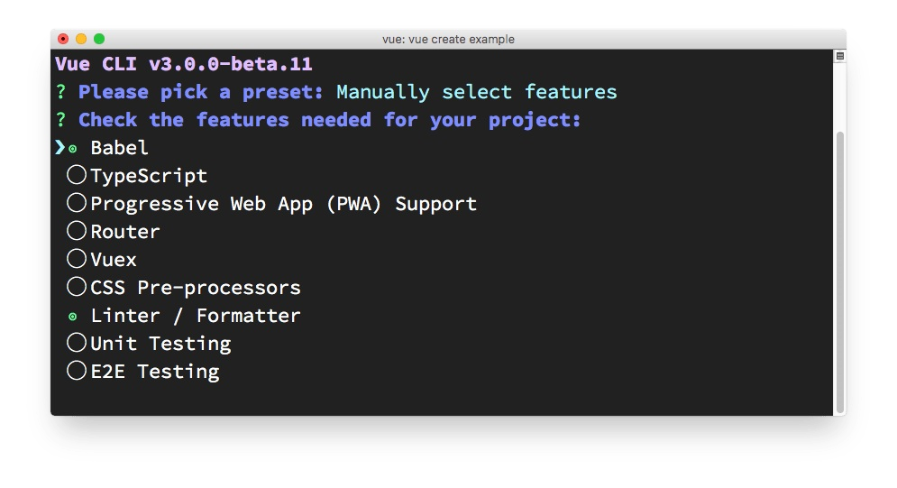
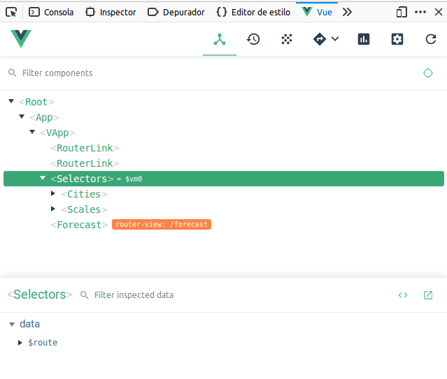

# Vue


### Grupo 4

###### Natalia Barra - Luis Chodiman - Mauricio Ortiz

---

# Pero primero... la demo!

---

# Puntos principales


- Herramientas útiles
  - Vue CLI
  - DevTools
  - Vetur
  - Vuetify
- Vue
  - Single File Components
  - Vue vs React
- Vuex
- Router
- Testing

---
# Herramientas útiles
## Vue CLI

- Vue Command Line Interface
- Otorga herramientas para acelerar la creación de un proyecto Vue

```bash
vue create <project-name>
```
---
- Configurable: 

- También hay una versión con interfaz gráfica
---

## DevTools
- Herramienta para inspeccionar aplicación
(similar a la de React)
- Integración con Vuex
- Disponible en Chrome, Firefox y como aplicación independiente
---



---
## Vetur 


- Plugin sumamente útil
- Soporta todos los lenguajes utilizados en Vue
- Snippets (con scaffolding), autocompletado, linting, error checking, code formating

---
## Vuetify 

Framework con componentes para Vue basado en Material Design. 

- Aplicaciones bonitas en menos tiempo
- [Documentación extensa](https://vuetifyjs.com/en/getting-started/quick-start)

##### Instalación: 
```batch
yarn add vuetify
```

--- 
##### Setup en la aplicación:
`main.js`
```javascript
import Vue from 'vue'

// Importación A-La-Carte
import Vuetify, {
  VApp, // Importar siempre
  VFooter //Componente que se va a ocupar
} from 'vuetify/lib'

import 'vuetify/dist/vuetify.min.css' //Css

Vue.use(Vuetify, {
  components: {
    VApp,
    VFooter
  }
})
```
--- 
###### Material Icons
`index.html`
```
<head>
  <link href='https://fonts.googleapis.com/css?family=Roboto:100,300,400,500,700,900|Material+Icons' rel="stylesheet">
</head>
```

###### Componente `v-app`
`App.vue`
```
<template>
  <div id="app">
    <v-app>
    ... Componentes
    </v-app>
  </div>
</template>
```
--- 
##### Uso:

`components/Cities.vue`
```
<template>
  <div class="citySelector selector">
    <v-autocomplete
      // Atributos
    ></v-autocomplete>
  </div>
</template>
```

---
# Vue

Aspectos importantes utilizados en la aplicación

---

## Single File Componets
Archivos `.vue` que contienen toda la estructura de un componente (HTML, JS, CSS)
```
<template>
</template>
<script>
export default {
  name: "componentName"
  data() { // state del componente
    return { // datos del state
      show: true
    }
  }
  method: {
    // funciones
  }
  // otras propiedades
}
</script>
<style>
</style>
```
---

# Vue vs React


# 

--- 
## Similitudes

- Frameworks JS enfocados en la interfaz de usuario (frontend)
- DOM Virtual
- Arquitectura basada en componentes

---
## Diferencias
- `<template>` vs `JSX`
- Comunidad
- Curva de aprendizaje
- Estado vs data
- Aplicaciones móviles

---
# Vuex
- Redux de Vue
- Características principales:
  - *store*: similar al de React. Además del state, contiene también los actions, mutations y getters.
  - *actions*: también actuan como "action-creators".
  - *mutations*: básicamente los "reducers"
  - *getters*: retornan información del store.
---
### Ejemplo
*store* (`store/index.js`)
```javascript
import Vuex from "vuex";
import actions from "./actions";
import mutations from "./mutations";
import getters from "./getters";

Vue.use(Vuex);

export default new Vuex.Store({
  state: {
    id: 3871336,
    name: "Santiago",
    // more variables...
  },
  getters,
  mutations,
  actions
});
```
---
`store/action.js`
```javascript
export default {
  async fetchWeather(context) {
    const { commit, state } = context;
    commit("fetchingContent");
    const { id, scale } = state;
    const weatherData = await fetch(
      `http://api.openweathermap.org/data/2.5/weather?id=${id}&APPID=${
        process.env.VUE_APP_APP_ID
      }&units=${scale.param}`
    ).then(data => data.json());
    commit("updateWeather", weatherData);
  }
}
```
- `commit(mutation, payload)` informa a la store que realizar
---

- Componentes pueden llamar a la acción directamente mediante `mapActions`.

```javascript
export default {
  name: "home",
  // ....
  methods: {
    ...mapActions(["fetchWeather"]) //mapeamos la función desde el store
  },
  watch: {
    city() {
      this.fetchWeather(); // lo llamamos como método
    }
  }
  // ...
}
```
- También pueden hacerlo sin lo anterior haciendo`dispatch` a la store.

```javascript
this.$store.dispatch("fetchWeather");
```

---
`store/mutations.js`
```javascript
export default {
  updateWeather(state, weatherData) {
    if (state.lastFetch) {
      state.history.push(state.lastFetch);
    }
    state.lastFetch = weatherData;
    state.fetching = false;
  }
}
```

- Importante: mutations DEBEN ser **síncronas**. Sin ello, no se pueden trackear los cambios realizados.

---
`store/getters.js`
```javascript
export default {
  cityName(state) {
    return state.name;
  }
};
```
`views/Forecast.vue`
```javascript
export default {
  computed: {
    ...mapGetters({
      city: "cityName",
    })
  }
}
```
- Útil cuando múltiples componentes requieren un mismo elemento alterado (pre-procesar data).

---

# Router

---
## Componente router
`router.js`
```
import Vue from "vue";
import Router from "vue-router";
import Home from "./views/Home.vue";
// Otras vistas

Vue.use(Router);

export default new Router({
  routes: [
    {
      path: "/",
      name: "home",
      component: Home
    },
    // Otras rutas
  ]
});
```
---
## Uso en la apliación
`main.js`
```
import Vue from "vue";
import router from "./router";

new Vue({
  router,
  render: h => h(App)
}).$mount("#app");
```

`App.vue`
```
  <div id="app">
    <div id="nav">
      <router-link to="/">Pronóstico del día</router-link>
      Otras rutas...
    </div>
    <router-view/> //Muestra la vista default
  </div>
```

---

# Testing

Instalación de dependencias, el _test runner_ y las utlidades de Vue

```bash
yarn add jest @vue/test-utils
```

Para enseñar a `Jest` a procesar archivos `*.vue`

```bash
yarn add vue-jest
```

Y para que entienda ES5:

```bash
yarn add babel-jest
```

---

Más configuración adicional, ahora en `package.json`:

```
"jest": {
  "moduleFileExtensions": [
    "js",
    "vue"
  ],
  "transform": {
    ".*\\.(vue)$": "vue-jest",
    "^.+\\.js$": "babel-jest"
  },
  "mapCoverage": true
}
```

---

Pero, como nuestros componentes están enlazados a `Vuex`, hay que crear un _mock_ de la `store`.

`src/store/__mocks__/index.js`

```javascript
export const getters = {
  cityName: jest.fn().mockReturnValue("fake-city-name"),
  lastFetch: jest.fn().mockReturnValue({}),
  ...
};
export const mutations = {
  updateCity: jest.fn(),
  ...
};
export const actions = {
  updateCity: jest.fn(),
  ...
};
export const state = {
  id: 3871336,
  ...
};
```

---

```javascript
export function __createMocks(
  custom = { getters: {}, mutations: {}, actions: {}, state: {} }
) {
  const mockGetters = Object.assign({}, getters, custom.getters);
  const mockMutations = Object.assign({}, mutations, custom.mutations);
  const mockActions = Object.assign({}, actions, custom.actions);
  const mockState = Object.assign({}, state, custom.state);

  return {
    getters: mockGetters,
    mutations: mockMutations,
    actions: mockActions,
    state: mockState,
    store: new Vuex.Store({
      getters: mockGetters,
      mutations: mockMutations,
      actions: mockActions,
      state: mockState
    })
  };
}

export const store = __createMocks().store;
```

---

Y ahora sí ha testear:

```javascript
import Vuex from "vuex";
import { shallow, createLocalVue } from "vue-test-utils";
import { __createMocks as createStoreMocks } from "../store";
import Home from "./Home";
```

```javascript
jest.mock("../store");

const localVue = createLocalVue();

localVue.use(Vuex);
```

---

```javascript
describe("Home", () => {
  let storeMocks;
  let wrapper;

  beforeEach(() => {
    storeMocks = createStoreMocks();
    wrapper = shallow(Home, {
      store: storeMocks.store,
      localVue
    });
  });

  test("It should fetch the weather.", () => {
    expect(storeMocks.actions.fetchWeather).toBeCalled();
  });
});
```

---

Y la `store`? -> Igual que en el caso de `React`!

```javascript
test('"updateCity" changes the city id, name, lon and lat', () => {
  const state = {
    city: {
      id: "original-id",
      name: "original-name",
      lat: "original-lat",
      lon: "original-lon"
    }
  };

  const newCity = {
    id: "new-id",
    name: "new-name",
    lat: "new-lat",
    lon: "new-lon"
  };

  mutations.updateCity(state, newCity);

  expect(state.city).toEqual(newCity);
});
```

---

## Conclusiones del testing

- Menos información (tutoriales, artículos, blogs) en comparación a `React`, en especial en componentes con `Vuex`
- Se puede usar `Jest`
- `Enzyme` es reemplazado por `vue-test-utils`
- Es necesario realizar un _mock_ del `store` para testear componentes con `Vuex`
